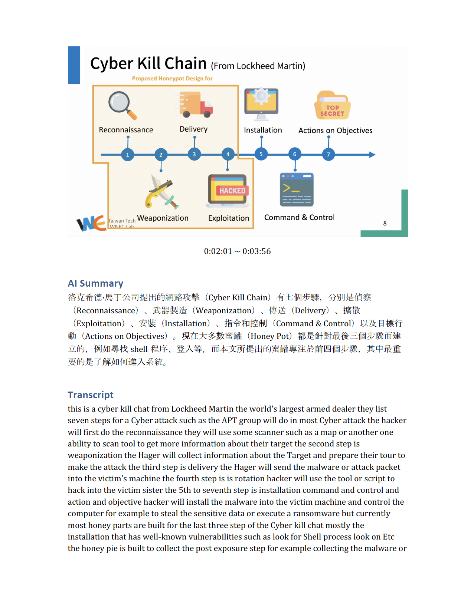

# TL;DW 
Too Long; Don't Watch

相信大家都囤了一大堆沒時間看的課程影片，這個小工具可以節省大量時間，直接透過 AI 整理出影片重點。

還能解決聽不懂的奇怪印度、日本之類的英文腔調~~聽不懂~~獨特問題。

本腳本使用 OpenAI 的 GPT3 幫忙把課程影片總結成文字，並產出繁體中文的 Docx 報告。

轉換時間依照影片時間而定，通常影片時間與轉換時間為 1:1，主要時間耗在 AI 總結以及語音轉文字的 API 呼叫上 QQ。

## 使用技術 / API
- Audio to Text: Google Speech to Text
    - Free
- Image to Text: Tesseract OCR
    - Free
- AI Summary: OpenAI GPT3
    - 製作 30 分鐘的影片約需 0.3 ~ 0.7 USD

## Pre-requirements
### Package
應該會需要裝 ffmpeg 之類的套件，還有一堆有的沒的，噴錯的話請自己 pip 裝一裝，我懶得列ㄌ

### Setup
- 可能會需要調整的參數
    - OPEN_AI_KEY：請自行至 https://platform.openai.com/account/api-keys 申請
    - THRESHOLD：如果截圖太敏感的話請把值減小
    - THREADS：選擇電腦的 CPU 核心數量
    - prompt：關於魔法詠唱部分，可視需求修改
    - 預設輸入僅支援英文影片 + 英文簡報，修改 98 行 & 108 行理論上可以支援其他語言，但我沒有測過...ㄏ。

## Usage
```
python3 main.py [file_name.mp4]
```

## Demo Result

(From: My Talk in BSide Tokyo / SECCON 2022)

